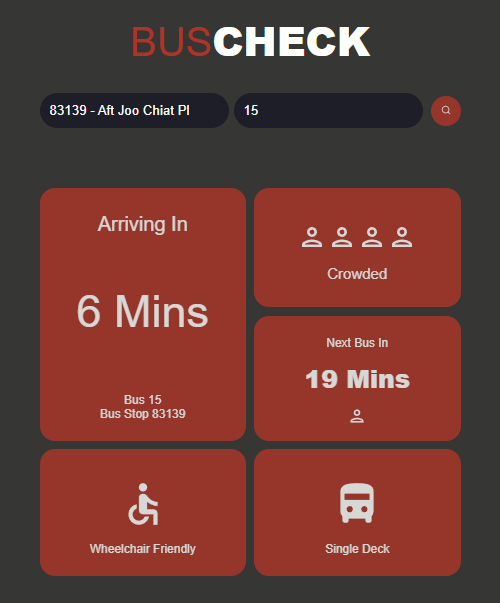

# Bus Checker API

### Link: [Bus Checker App](https://SDI4-G2.github.io/project-1)

---

## Description

Our group first project building an app utilizing LTA API, extracting its data and allowing users to search for bus information in real time.

Try using the app with the below examples when the buses are running!
<br>Eg.
<br>Bus Stop Code: ```83139``` - Bus No.: ```15```
<br>Bus Stop Code: ```64479``` - Bus No.: ```329```

```
Language Used: HTML, CSS and JavaScript

Core:
- React.js
- Hooks
- Axios
```

## Preview


